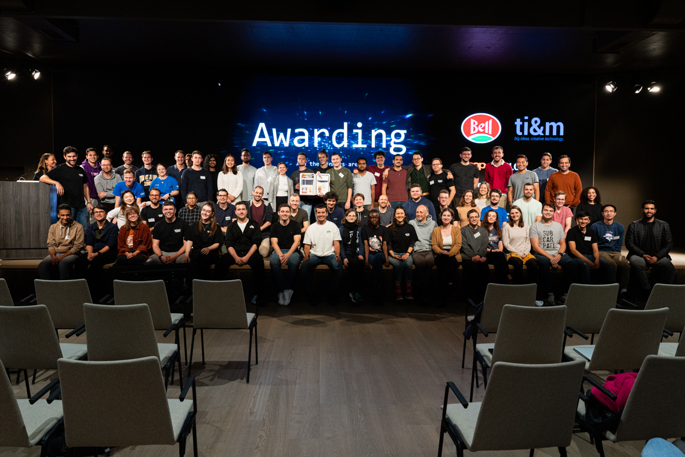
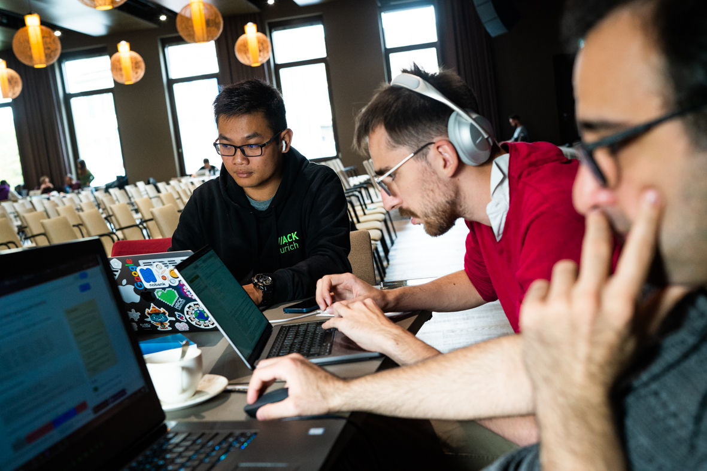

title: BaselHack Sponsoring 2023
author:
name: Verein BaselHack
url: https://www.baselhack.ch
output: theme.html
theme: darktheme

--

# BaselHack
## sponsoring info

--

## BaselHack is more than a hackathon – we connect people, take fun seriously and grow open innovation.

www.baselhack.ch
</centers>

--

### Review 22. & 23. October 2022 (HDW)

  
  
  

<canvas width="1024" height="300" id="wordcloud"></canvas>
--

### BaselHack Sponsoring

BaselHack has taken place each year since 2017, always with the *help* of sponsoring. 

For a sponsor, participating at BaselHack is an ideal instrument
for *Employer Branding*, *Recruiting* and *Digitization Campaigns*.

--

### Sponsoring packages 2023
<table>
    <tr>
        <th></th>
        <th>Silber Sponsor</th>
        <th>Gold Sponsor</th>
        <th>Haupt Sponsor</th>
        <th>Location Sponsor</th>
    </tr>
    <tr>
        <th></th>
        <td>CHF 1'500</td>
        <td>CHF 4'000</td>
        <td>CHF 6'000</td>
        <th></th>
    </tr>
    <tr>
        <th>Job Wall</th>
        <td>+</td>
        <td>+</td>
        <td>+</td>
        <td>+</td>
    </tr>
    <tr>
        <th>Logo auf baselhack.ch</th>
        <td>+</td>
        <td>+</td>
        <td>+</td>
        <td>+</td>
    </tr>
    <tr>
        <th>Logo/Tagging auf Social Media</th>
        <td>+</td>
        <td>++</td>
        <td>+++</td>
        <td>+*</td>
    </tr>
    <tr>
        <th>Logo auf Digital Signage</th>
        <td>+</td>
        <td>+</td>
        <td>+</td>
        <td>+</td>
    </tr>
    <tr>
        <th>Give-Aways an Teilnehmende</th>
        <td></td>
        <td>+</td>
        <td>+</td>
        <td>+</td>
    </tr>
    <tr>
        <th>Animation auf Digital Signage</th>
        <td></td>
        <td>+</td>
        <td>+</td>
        <td>+</td>
    </tr>
    <tr>
        <th>Bühnenzeit vor Rangverkündigung</th>
        <td></td>
        <td></td>
        <td></td>
        <td>+</td>
    </tr>   
    <tr>
        <th>CEO-Interview</th>
        <td></td>
        <td></td>
        <td>+</td>
        <td></td>
    </tr>
    <tr>
        <th>Kann Themen-Preis verleihen</th>
        <td></td>
        <td></td>
        <td>+</td>
        <td></td>
    </tr>
    <tr>
        <th>Kann Challenge mit Preisgeld stellen</th>
        <td></td>
        <td>+ CHF 1'000</td>
        <td>+ CHF 1'000</td>
        <td></td>
    </tr>
</table>

--

### Challenges

Each participant decides on a *team* and a *project* at the beginning of the hackathon.
They either work on a *freestyle challenge* or a *sponsored challenge*
Gold and main sponsors can, for an additional fee, set up a Challenge
with fixed prize money, e.g. to arrive at a code prototype for a concrete digitalisation problem as part of the hackathon.

In addition, main sponsors can also award a *special prize* across all teams, in relation to defined
criteria in an overarching concern (e.g. sustainability award).

--

### Multimedia on site

The *largest LED wall* in Northwestern Switzerland is available for the Baselhack.
Our team will help you with the placement of your brand (video and image formats, etc).
Fairness is in order: with 1-2 hours we are happy to help all sponsors.We and our network can help with more specific requests.

--

### Strengthen your employer brand

* Sharpen your profile in the tri-border region as *tech employer*
* *Cost-efficient* alternative to an own in-house hackathhon, especially for SME
* General promotion and contribution to the attractiveness of the *tri-border region* as a tech location

-- 

### Secure talent

Send your employees to the hackathon and let them *connect* to potential employees and young professionals while directly *working on something meaningful* - this will have a lasting impact.

--

### Lead technological innovation

* Innovation and co-creation: BaselHack as an *ignitor event* outside of the operative business as usual
* Key technologies: promote your *open source and open data* technology stack

[//]: # (  As the main sponsor complementary to the BaselHack a satellite event can take place at the take place around the company,)

[//]: # (  key technologies and a case for the to pitch the company, key technologies and a case for the BaselHack.)

[//]: # (* Innovation and co-creation: BaselHack as an "idea igniter outside the operational 9-to-5 business.)

[//]: # (* Access to other "talents", which in a very short time new perspectives, approaches or technologies)

[//]: # (  or technologies.)

--

### Team and contact

//TODO: Avatare, Name & Funktion

--

### Sponsor, Partner ... why?

1. Social *impact* in the region
2. Positioning of your *brand*
3. *Visibility* in the networks of partners, sponsors, board members
4. *Inspiration* for your employees
5. *Innovation* catalyst for your organisation

-> Get in touch with us